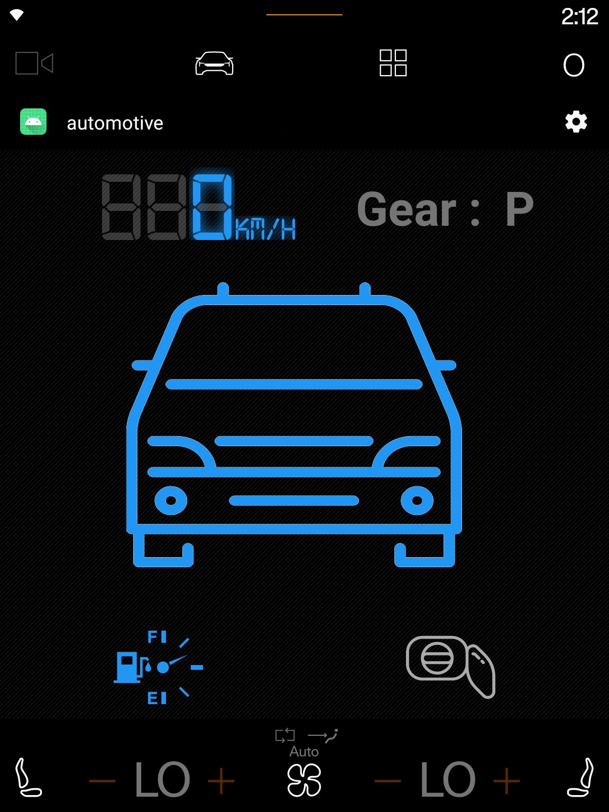
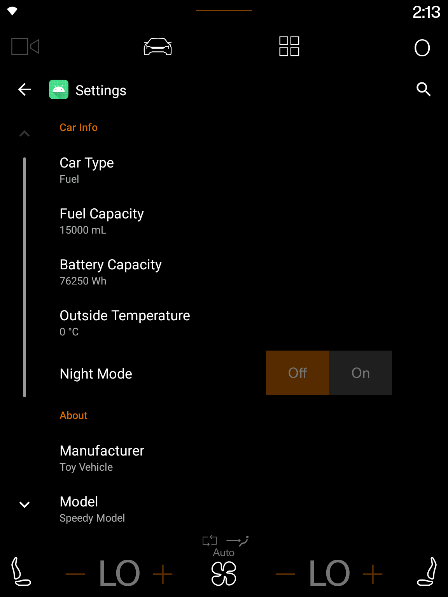
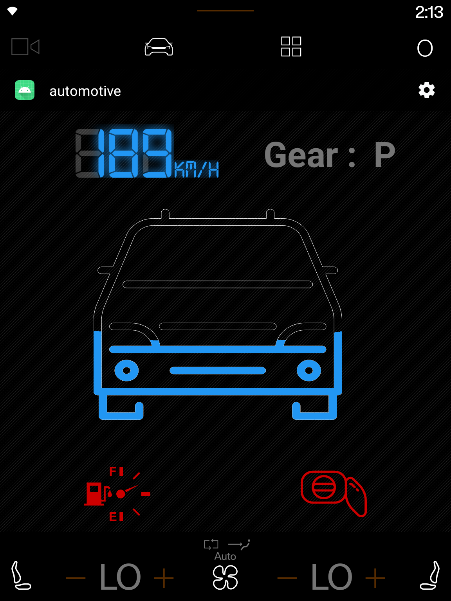

# Car Info -Android Automotive App-

This is a sample Android Automotive App, it uses the different car apis and UI elements built spesifically for automotive, to access the differents sensors and VHAL properties for the car. 

## Screenshots
<br><br>
[](screenshots/screenshot1.png)
<br><br>
[](screenshots/screenshot2.png)
<br><br>
[](screenshots/screenshot3.png)
<br><br>
[](screenshots/screenshot4.gif)

## Setup
Clone this repository and import into **Android Studio**
```bash
git clone https://github.com/islem19/Android-Automotive-Info-App.git
```

## Car UI Lib 
The car UI lib is part of the android automotive OS source code (AOSP) and it contains the different UI elements implemented and designed to spesifically run on the car infotainment system and adhere to the UI/UX of the Android Automotive OS. the lib isn't available for public to include it as gradle dependency, so it should be included manually as a module and build alongside the app. 


## Permissions
The App requires the following permissions:
-Car speed: this permission is required to access to the car speed property.
-Car powertrain: this permission is required to access to the car gear selection property.
-Car energy: this permission is required to access to the car level and type of fuel property.
-Car energy Ports: this permission is required to access to the car fuel ports property.
-Car Info: this permission is required to access to the car information (manufactrure, VIN, model..) property.
-Car exterior environment: this permission necessary to read temperature of car's exterior environment


## Maintainers
This project is mantained by:
* [Abdelkader Sellami](https://github.com/islem19)


## Contributing

1. Fork it
2. Create your feature branch (git checkout -b my-new-feature)
3. Commit your changes (git commit -m 'Add some feature')
4. Push your branch (git push origin my-new-feature)
5. Create a new Pull Request


## License
This application is released under GNU GPLv3 (see [LICENSE](LICENSE)). Some of the used libraries are released under different licenses.
